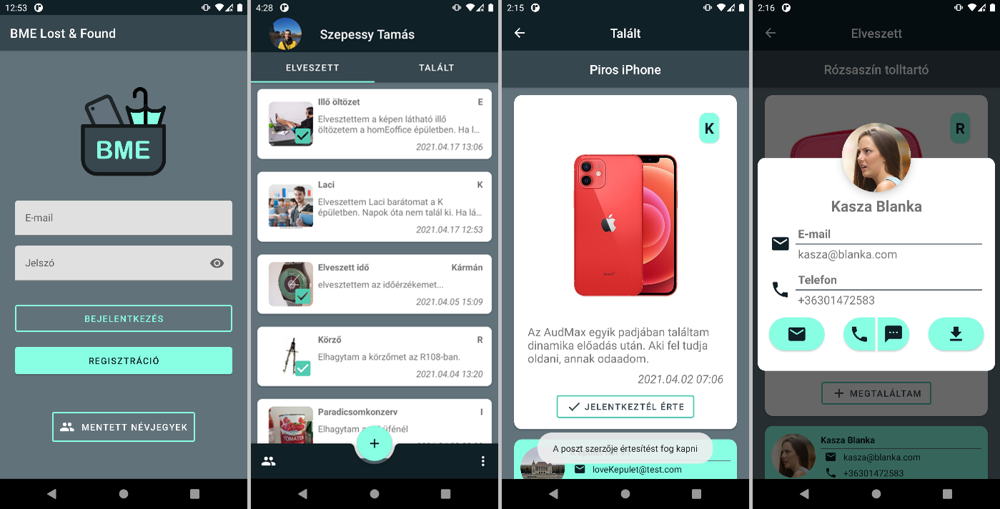

# BME Lost & Found

## Description

This project was created for the subject Android-based Software Development at the Budapest University of Technology. It is written in Kotlin, using Android Studio as debugging platform.

The app should be compatible with Android versions 5.0+, its server is based on Firebase, so it may become unavailable after some time. APK is available for testing.

The main idea was to implement as meny Android software elements as possible winto an app, which has a purpose. Since everyone has surely lost something at their own university, I decided to make an app for mine. After registration, one can add lost or found items with images, description and place. Users can sign up for an item (whethr they lost it or found it) and the item poster will get a notification. Contacts can be stored in a local database for offline access.

## Documentation

You can find a DeepL translated documentation of the Hungarian version. Any errors and mistranslated sections are because of this. There is a brief overview of the project and an explanation of the Kotlin files.

Firebase personal access tokens have been removed from the uploaded code.

## License

MIT License

Copyright © 2021 TamasSzepessy
